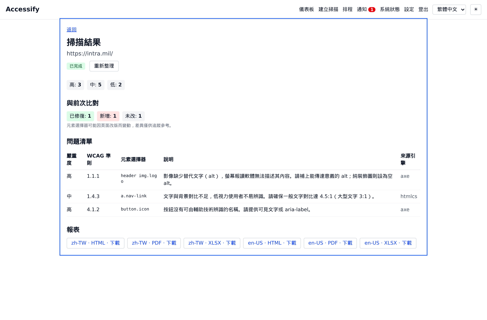
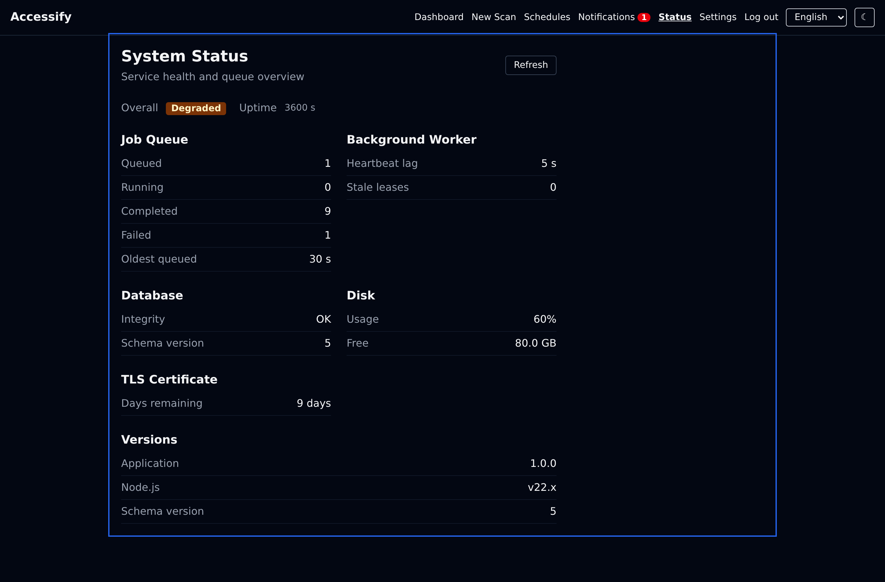

# Accessify

**地端、無網際網路（軍用網路）場域的無障礙網頁檢測工具。**

對內網站台執行 WCAG 2.0/2.1（A・AA）自動檢測，產出**繁體中文（台灣）/ 英文（美國）雙語報表**
（HTML / PDF / Excel）。定位為**人工檢測前的自動化輔助**，誠實標示涵蓋率，**不宣稱 100% 合規**。

> **狀態：v1.0.0 — 首個完整交付（M0–M7 全數完成）。** 發布說明見
> [`docs/releases/v1.0.0.md`](docs/releases/v1.0.0.md)、變更見 [`CHANGELOG.md`](CHANGELOG.md)。
> 本專案由 [AI-SOP-Protocol (ASP)](https://github.com/astroicers/AI-SOP-Protocol) 治理，採 autopilot
> ROADMAP 驅動開發。設計原則：**穩定優先、離線自足、最少元件、強制 i18n**。

## 設計重點

- **離線**：執行期零對外網際網路請求；Chromium、字型、依賴全部內建打包。
- **穩定**：Docker Compose 單機、pin 版本、可重現建置、可靠的離線升級 + 回滾。
- **簡化**：SQLite + 內嵌佇列（無獨立 DB / Redis）；本地檔案系統儲存報表。
- **i18n**：i18next，僅 zh-TW（預設）/ en-US（fallback），禁 hardcoded 字串。
- **自身無障礙**：本工具的 Web Portal 自身須通過 WCAG 2.1 AA。

## 技術棧

Node.js + TypeScript 全棧 monorepo · Playwright（headless Chromium）+ axe-core + HTML_CodeSniffer ·
SQLite（WAL）+ 內嵌佇列 · Fastify · React 19 + Vite + Tailwind（visual-web-stack 基礎層）·
報表 i18n HTML → PDF（Playwright print，內建 CJK 字型）+ Excel（ExcelJS）· Docker Compose。

決策依據見 [`docs/adr/`](docs/adr/)（ADR-001~011，全 Accepted）。

## 部署形態與平台

交付形態是 **Docker Compose 兩個容器**（`api` + `worker`，共用同一映像），**不是單一執行檔（binary）**。
平台支援分兩端：

| 角色 | 平台 |
|------|------|
| **伺服器端**（跑掃描引擎的主機） | **Linux 容器**（`node:22-bookworm-slim` + 內建 Chromium）。Windows 主機需透過 **Docker Desktop / WSL2** 執行；**不提供原生 Windows 版**（穩定優先，避免多一條建置／離線打包／回滾線）。地端機房常態即 Linux server。 |
| **使用者端**（操作的人） | **任何作業系統的瀏覽器**（Windows / macOS / Linux）皆可，**無需安裝任何元件**，開 `https://<主機>:8443` 即用。 |

> 一句話：伺服器跑在 Linux（Docker），使用者在 Windows 等任何系統用瀏覽器操作。

## 介面預覽

完整 **React Web Portal**：登入、儀表板、建立掃描、掃描結果、排程、通知、設定、系統狀態，
自身通過 WCAG 2.1 AA。完整截圖（8 頁 × zh-TW 淺色 + en-US 深色，共 16 張，可由
`node scripts/screenshots.mjs` 重現）見 [`docs/screenshots/`](docs/screenshots/)。

| 掃描結果（繁中淺色） | 系統狀態（英文深色） |
|---|---|
|  |  |

## 快速開始（地端離線）

```bash
# 1) 有網建置環境：打包離線安裝包（映像 tar + 部署檔）
scripts/package-offline.sh 1.0.0

# 2) 現場（斷網）主機：安裝並冒煙驗證
ACCESSIFY_TAG=1.0.0 scripts/install.sh accessify-image-1.0.0.tar.gz
scripts/verify.sh

# 3) 取一次性 admin 密碼（登入後立即改密），瀏覽器開 https://<主機>:8443
docker compose logs api | grep 'initial admin password'
```

登入後於「設定」頁設定**掃描白名單**（空白名單＝拒絕所有掃描，屬安全預設）。
維運（備份／還原／升級／回滾）見 [`docs/RUNBOOK.md`](docs/RUNBOOK.md)，部署驗收見
[`docs/ACCEPTANCE.md`](docs/ACCEPTANCE.md)。

## 文件

| 文件 | 內容 |
|------|------|
| [`docs/releases/v1.0.0.md`](docs/releases/v1.0.0.md) | v1.0.0 發布說明（中英對照） |
| [`CHANGELOG.md`](CHANGELOG.md) | 變更紀錄 |
| [`ROADMAP.yaml`](ROADMAP.yaml) | Autopilot 任務清單（M0–M7，全數完成） |
| [`docs/SRS.md`](docs/SRS.md) | 軟體需求規格 |
| [`docs/SDS.md`](docs/SDS.md) | 軟體設計規格（含 API） |
| [`docs/UIUX_SPEC.md`](docs/UIUX_SPEC.md) | UI/UX 規格（含自身無障礙硬規格） |
| [`docs/DEPLOY_SPEC.md`](docs/DEPLOY_SPEC.md) | 地端離線部署 / 備份 / 升級回滾 |
| [`docs/RUNBOOK.md`](docs/RUNBOOK.md) | 維運手冊（備份／還原／升級／回滾／TLS） |
| [`docs/ACCEPTANCE.md`](docs/ACCEPTANCE.md) | 部署驗收清單 |
| [`docs/adr/`](docs/adr/) | 架構決策記錄（ADR-001~011，全 Accepted） |

## 已知限制

- **自動檢測非完整 AA**：axe / HTMLCS 僅涵蓋「自動可判定」部分（約 27%），其餘準則仍須人工複核。
- **內網 SMTP 外送通知未實作**：屬新執行期相依 + 出站路徑，待 **ADR-012** 核准後實作；站內通知已可用。

常用 ASP 指令見 `make help`。
